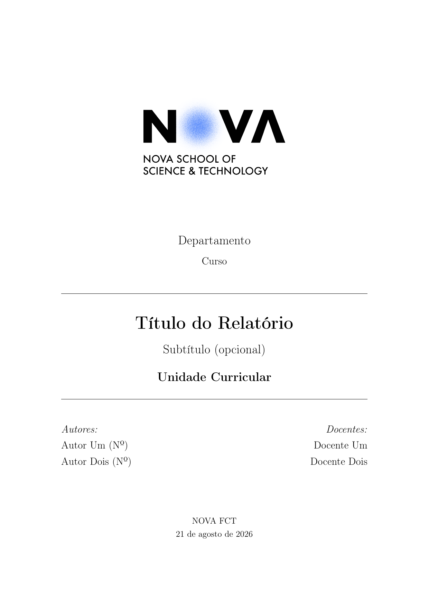

# Template de Relatório LaTeX (NOVA FCT)

Template de relatório em LaTeX **pronto a usar**, que cumpre os requisitos de formatação exigidos para relatórios na **NOVA FCT** (Universidade NOVA de Lisboa, Faculdade de Ciências e Tecnologia): capa com o logótipo oficial, margens de 3 cm, cabeçalho/rodapé com numeração "página de total", títulos de secção estilizados, e estrutura pré-textual/textual/apêndices.

Não precisas de copiar nada para outra pasta nem correr scripts: edita os ficheiros deste repositório diretamente e compila.

## Pré-visualização



## Começar a usar

1. Faz *fork*/*clone* deste repositório (ou usa o botão **"Use this template"** no GitHub, se disponível). Não precisas de copiar a pasta para outro sítio: este repositório **é** o teu relatório.
2. Edita [tex/metadata.tex](tex/metadata.tex) com o título, autores, curso e restante informação da capa.
3. Escreve o conteúdo em [sections/](sections/) e [appendix/](appendix/), e as referências em [bibliography.bib](bibliography.bib).
4. Compila com `make pdf`.

## Compilar

```bash
make pdf     # compila o relatório para build/main.pdf
make watch   # compila automaticamente sempre que gravas um ficheiro
make clean   # remove os ficheiros de build
```

Todos os outputs (PDF, `.aux`, `.log`, etc.) vão para `build/`, para manter a raiz do repositório limpa.

## Onde editar

| Ficheiro / pasta | Para quê |
|---|---|
| [tex/metadata.tex](tex/metadata.tex) | Título, subtítulo, curso, instituição, autores, docentes, data, idioma |
| [sections/](sections/) | Capítulos do relatório (introdução, metodologia, resultados, ...) |
| [appendix/](appendix/) | Anexos |
| [bibliography.bib](bibliography.bib) | Referências bibliográficas (BibTeX) |
| [img/](img/) | Figuras; `img/logo.png` é usado automaticamente na capa |
| [tex/settings.tex](tex/settings.tex) | Flags do template (ex.: ativar `minted`) |
| [tex/template.sty](tex/template.sty) | Estilo/layout (margens, cores, cabeçalho/rodapé, pacotes); normalmente não precisas de mexer aqui |
| [main.tex](main.tex) | Ponto de entrada; adiciona/remove secções e apêndices aqui |

O relatório inclui `\tableofcontents` e um exemplo de bloco de destaque (`exampleblock`) e citação, visíveis na pré-visualização acima.

## Idioma

O relatório vem em português por defeito, mas suporta também inglês (via `babel`). Muda em [tex/metadata.tex](tex/metadata.tex):

```latex
\newcommand{\ReportLanguage}{portuguese} % ou english
```

Se mudares para inglês, atualiza também os títulos das secções em [sections/](sections/) e [appendix/](appendix/).

## Logótipo NOVA FCT

O template já inclui `img/logo.png` (logótipo da NOVA FCT) e usa-o automaticamente na capa. Para outra instituição, basta substituir esse ficheiro por outro logótipo (ou apagá-lo, a capa ajusta-se automaticamente sem logo).

## minted (opcional)

Por defeito o template usa `listings` para blocos de código, para não exigir `-shell-escape`. Se preferires `minted`:

1. Em [tex/settings.tex](tex/settings.tex), muda para `\usemintedtrue`.
2. Em [.latexmkrc](.latexmkrc), descomenta a linha com `-shell-escape`.

Requer `pygments` instalado (`pip install pygments`).
